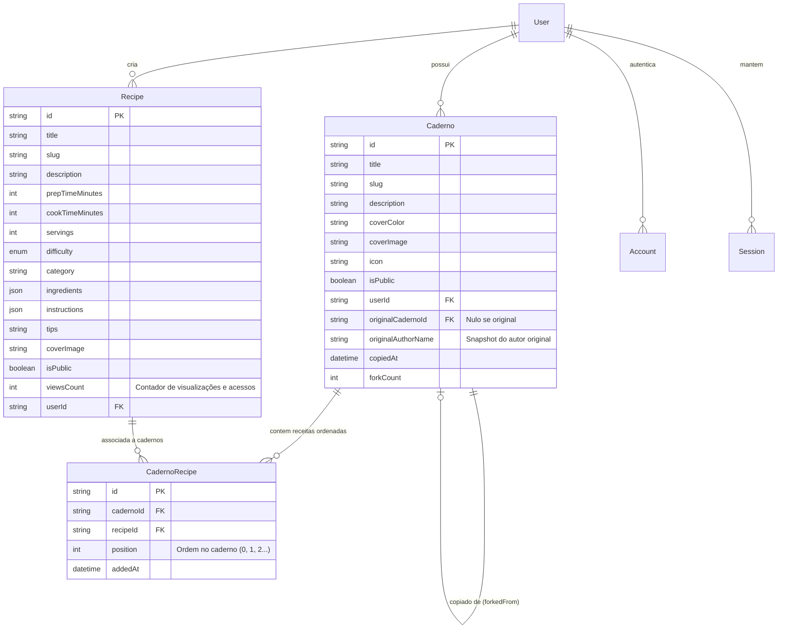

# Arquitetura do Sistema

> **Caderno de Delícias** (`cadernodedelicias.com.br`)  
> Visão geral técnica, modelo de dados, fluxos de autenticação, atribuição de cadernos e mobile.

---

## 1. Estrutura do Projeto

O projeto é uma aplicação **Next.js Fullstack (App Router)** independente, consolidando o front-end web e a API REST no mesmo repositório:

```
web/
├── src/
│   ├── app/                     # App Router: Páginas, layouts e rotas de API (/api/*)
│   │   ├── (auth)/              # Rotas de login e registro
│   │   ├── api/                 # Endpoints REST (auth, cadernos, receitas, categorias)
│   │   ├── cadernos/            # Páginas de listagem, criação, edição e detalhe de cadernos
│   │   ├── descobrir/           # Feed público e busca global
│   │   ├── doar/                # Página de doação via Pix e transparência de custos
│   │   ├── receitas/            # Páginas de minhas receitas, nova receita e detalhe
│   │   ├── termos/              # Termos de Uso e Política de Privacidade (LGPD)
│   │   └── privacidade/         # Redirecionamento amigável para política de privacidade
│   ├── components/              # Componentes de interface (Navbar, Footer, Cards, Banners)
│   └── lib/                     # Utilitários, auth (JWT/bcryptjs) e client do Prisma
│       └── prisma/              # Singleton do PrismaClient e exportação de tipos/enums
├── prisma/
│   ├── schema.prisma            # Modelagem do banco relacional PostgreSQL
│   └── seed.ts                  # Carga inicial com dados realistas da comunidade
├── public/                      # Assets estáticos (ícones, logos, QR Code Pix)
├── docs/                        # Documentações técnicas e de negócio
├── .env.example                 # Exemplo de variáveis de ambiente
├── AGENTS.md                    # Diretrizes de desenvolvimento e commits atômicos
├── LICENSE                      # Licença MIT
└── package.json                 # Dependências e scripts (dev, build, db:push, db:seed)
```

---

## 2. Modelo de Dados & Relacionamentos

Utiliza **Prisma ORM** com **PostgreSQL**.



---

## 3. Regra de Negócio: Cópia e Atribuição de Cadernos (Fork System)

1. **Requisito de Origem Pública**:
   - Um usuário **só pode copiar cadernos que sejam públicos** (`isPublic = true`).
   - Se o caderno for privado, a API rejeita a operação com erro HTTP 403.
2. **Atribuição Obrigatória e Permanente**:
   - O novo caderno criado na conta do usuário herda o ponteiro `originalCadernoId` e o `originalAuthorName`.
   - Na interface do usuário, todo caderno que possui origem exibe em destaque o componente **`ForkBadge`**:
     > *"🌿 Caderno inspirado e copiado de [Nome do Caderno Original] por @NomeDoAutor"*
   - Essa menção mantém o link clicável direto para o caderno original público, honrando o criador original.
3. **Preservação e Reordenação**:
   - As receitas vinculadas ao caderno original são copiadas para a tabela de junção `CadernoRecipe` do novo caderno, preservando inicialmente a ordem original (`position`).
   - O novo proprietário pode reordenar, adicionar novas receitas ou remover receitas no seu caderno copiado sem afetar o caderno original.
4. **Exibição nas Receitas (Privacidade & Popularidade)**:
   - Na página de detalhes da receita, a seção *"Esta receita está nos cadernos"* exibe no máximo **2 dos cadernos públicos mais acessados** da comunidade.
   - Cadernos privados nunca têm títulos ou dados de autores expostos publicamente; exibe-se apenas a métrica agregada (*"Salvo em X cadernos privados"*), com link seguro para o próprio usuário caso ele possua a receita em seu caderno pessoal.
5. **Adição a Cadernos Pessoais (`AddRecipeToCadernoButton`)**:
   - Na página de detalhes da receita (`/receitas/[id]`), o usuário logado dispõe do botão de ação *"Salvar no Meu Caderno"*.
   - Ao clicar, abre-se um modal permitindo adicionar a receita a qualquer um dos seus cadernos (com indicação visual se a receita já consta naquele caderno).
   - **Regra de interface estrita**: A página da receita nunca exibe a opção de remoção, evitando exclusões acidentais fora do contexto da coleção.
6. **Remoção Estritamente no Contexto do Caderno (`RemoveRecipeFromCadernoButton`)**:
   - A opção de remover uma receita de um caderno só aparece **dentro do próprio caderno onde a receita está inserida**, e exclusivamente para o criador/dono do caderno.
   - Disponível tanto na visualização do caderno (`/cadernos/[id]`) quanto na tela de reordenação (`/cadernos/[id]/editar` via `RecipeOrderManager`).
   - A remoção desassocia o registro na tabela `CadernoRecipe`, mantendo a receita original intacta no banco de dados.
7. **Métricas de Acesso e Descoberta de Receitas (`/descobrir` e Home)**:
   - A entidade `Recipe` possui o contador atômico `viewsCount`, incrementado de forma assíncrona a cada visualização de detalhe da receita (`/receitas/[id]`).
   - Na tela de descoberta (`/descobrir`), a aba *Receitas da Comunidade* é classificada por padrão pelas **receitas mais acessadas** (`viewsCount: desc`), com suporte a alternância rápida para *Mais Recentes*.
   - Os cards de receitas (`RecipeCard`) e a página de detalhes exibem o selo com ícone de visualização (`Eye`) indicando a popularidade do prato.

---

## 4. Autenticação e Segurança

- Suporte nativo a múltiplos provedores e fluxo de credenciais:
  1. **Credentials (Email e Senha)**: com hash seguro `bcryptjs`, validação via `zod` e sanitização.
  2. **Google OAuth**: Login em 1 clique com conta Google (`GOOGLE_CLIENT_ID` e `GOOGLE_CLIENT_SECRET`).
  3. **Recuperação e Redefinição de Senha**:
     - Solicitação em `/esqueci-senha` gerando token criptográfico seguro de 32 bytes (`VerificationToken`) com validade de 1 hora.
     - Proteção contra enumeração de contas (resposta neutra de sucesso mesmo se e-mail não existir).
     - Despacho modular via Resend ou log de depuração no terminal em desenvolvimento local.
     - Redefinição em `/redefinir-senha?token=...`, atualização de hash via `bcryptjs` e invalidação atômica de tokens de uso único.
- Sessão gerenciada com JWT seguro via cookies `HttpOnly` (`jose`) e controle de acesso baseado em papéis (`USER` e `ADMIN`).
- **Privacidade & Conformidade com LGPD (`/termos` e `/privacidade`)**:
  - Política explícita de zero anúncios invasivos e proibição de venda de dados a corretores ou redes terceiras.
  - Direitos plenos do titular garantidos (acesso, correção, portabilidade e exclusão de conta).
  - Preservação moral da autoria das receitas e atribuição automática nos cadernos copiados (`ForkBadge`).

---

## 5. Experiência Mobile & Responsividade

- A aplicação web foi desenhada com foco em **Mobile-First**:
  - `MobileBottomNav`: Barra de navegação inferior estilo aplicativo nativo para telas pequenas.
  - Safe Area & Viewport otimizados para notch e ilha dinâmica (`viewportFit: "cover"`).
  - Regras no CSS global para evitar zoom indesejado ao focar em inputs no iOS Safari (`font-size: 16px`).
  - Toque suave com `-webkit-tap-highlight-color: transparent` e layout com `main` flexível para acomodar navegações inferiores.

---

## 6. Sistema de Doações via Pix & Sustentabilidade Aberta

- **DonationBanner (`src/components/DonationBanner.tsx`)**:
  - Banner dinâmico na página inicial que permite cópia imediata da chave Pix com feedback visual sem sair da tela.
  - Botão para abrir modal rápido com QR Code e cópia rápida da chave Pix oficial.
  - Link direto para a página `/doar` com detalhamento das metas e infraestrutura.
- **PixDonationCard (`src/components/PixDonationCard.tsx`)**:
  - Componente com grid responsivo exibindo a chave aleatória oficial com botão de 1 clique e renderização do QR Code SVG para escaneamento direto pelo app do banco.
  - Função utilitária de cópia robusta (`copyToClipboard`) com fallback cross-browser (`document.execCommand`).
- **Transparência de Custos & Destino do Excedente (`/doar#transparencia`)**:
  - Detalhamento dos custos fixos mensais de infraestrutura (~R$ 100/mês) e política de destinação do excedente para valorização do trabalho contínuo do desenvolvedor e reinvestimento na plataforma.

---

## 7. Armazenamento e Entrega de Imagens (Uploads & Volumes Docker)

- **Diretório Persistente (`/app/uploads` e `./upload`)**:
  - Imagens enviadas por usuários são salvas como arquivos físicos no disco montado via volume Docker, mantendo o banco de dados relacional leve e performático.
  - Resolução resiliente através de [`src/lib/storage.ts`](file:///home/lucas/projetos/open_source/caderno-de-delicias/web/src/lib/storage.ts) suportando `UPLOADS_DIR`, volume Docker `/app/uploads` ou `./upload` local.
- **API de Upload (`POST /api/upload`)**:
  - Exige autenticação de sessão (`requireAuth`).
  - Suporta tanto `multipart/form-data` quanto imagens comprimidas via Canvas em base64.
  - Gera nomes únicos resistentes a colisão com timestamp e entropia criptográfica (`receita-[timestamp]-[hash].[ext]`).
- **Entrega Estática com Cache Imutável (`GET /uploads/[...path]` e `/upload/[...path]`)**:
  - Proteção estrita contra *directory traversal* através de `path.basename`.
  - Headers HTTP de alta performance: `Cache-Control: public, max-age=31536000, immutable`.

