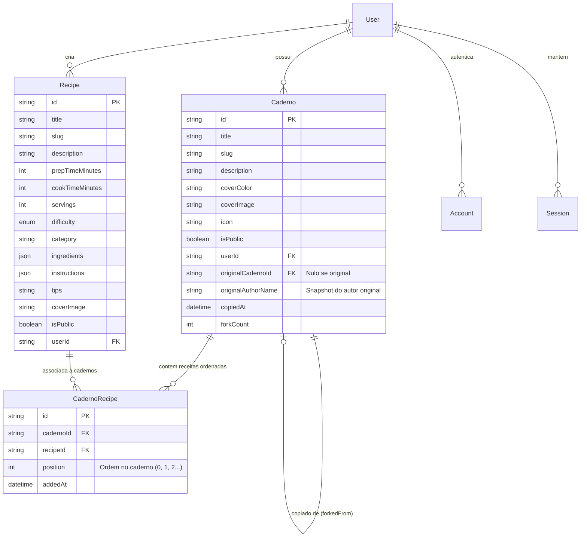

# Arquitetura do Sistema

> **Caderno de Delícias** (`cadernodedelicias.com.br`)  
> Visão geral técnica, modelo de dados, fluxos de autenticação, atribuição de cadernos e mobile.

---

## 1. Estrutura do Monorepo

O projeto adota a arquitetura de **npm workspaces** com separação clara de responsabilidades entre aplicações e pacotes compartilhados:

```
caderno-de-delicias/
├── apps/
│   ├── web/                     # Aplicação Next.js 15+ (App Router, Front-end & Back-end API)
│   └── mobile/                  # Aplicação Expo / React Native (WebView shell + scaffolding nativo)
├── packages/
│   └── database/                # Schema Prisma, Migrações, Client compartilhado e Seeds
├── docs/
│   ├── MONETIZATION.md          # Diretrizes e ideias éticas de monetização
│   └── ARCHITECTURE.md          # Este documento
├── docker-compose.yml           # PostgreSQL + Web prontos para desenvolvimento e deploy
├── package.json                 # Workspaces e scripts raiz
├── AGENTS.md                    # Diretrizes de contribuição para agentes de IA e humanos
└── README.md                    # Documentação principal
```

---

## 2. Modelo de Dados & Relacionamentos

Utiliza **Prisma ORM** com **PostgreSQL**.



---

## 3. Regra de Negócio: Cópia e Atribuição de Cadernos (Fork System)

1. **Requisito de Origem Pública**:
   - Um usuário **só pode copiar cadernos que sejam públicos** (`isPublic = true`).
   - Se o caderno for privado, a API rejeita a operação com erro HTTP 403.
2. **Atribuição Obrigatória e Permanente**:
   - O novo caderno criado na conta do usuário herda o ponteiro `originalCadernoId` e o `originalAuthorName`.
   - Na interface do usuário, todo caderno que possui origem exibe em destaque o componente **`ForkBadge`**:
     > *"🌿 Caderno inspirado e copiado de [Nome do Caderno Original] por @NomeDoAutor"*
   - Essa menção mantém o link clicável direto para o caderno original público, honrando o criador original.
3. **Preservação e Reordenação**:
   - As receitas vinculadas ao caderno original são copiadas para a tabela de junção `CadernoRecipe` do novo caderno, preservando inicialmente a ordem original (`position`).
   - O novo proprietário pode reordenar, adicionar novas receitas ou remover receitas no seu caderno copiado sem afetar o caderno original.

---

## 4. Autenticação e Segurança

- Suporte nativo a múltiplos provedores via **Auth.js / NextAuth**:
  1. **Credentials (Email e Senha)**: com hash seguro `bcryptjs`, validação via `zod` e sanitização.
  2. **Google OAuth**: Login em 1 clique com conta Google (`GOOGLE_CLIENT_ID` e `GOOGLE_CLIENT_SECRET`).
  3. Extensível para GitHub, Apple ou links mágicos por email.
- Sessão gerenciada com JWT seguro ou persistência em banco via Adapter.

---

## 5. Estratégia Mobile (React Native / Expo)

- A pasta `apps/mobile` contém o projeto Expo configurado para distribuir o aplicativo em Android e iOS:
  - **Abordagem WebView Acelerada**: O app inicial carrega de forma fluida a versão otimizada de `cadernodedelicias.com.br`, integrando:
    - Suporte a Safe Area (Notch, Dynamic Island e barras do sistema).
    - Status bar integrada com as cores do Caderno de Delícias.
    - Tela de carregamento nativa suave e tratamento de conectividade offline.
    - Tratamento do botão Voltar nativo do Android para histórico de navegação.
  - **Evolução Progressiva para Telas Nativas**: A arquitetura permite migrar progressivamente telas específicas (como o leitor de receitas em modo cozinha com timer, ou a câmera para ler receitas) para código 100% nativo.
